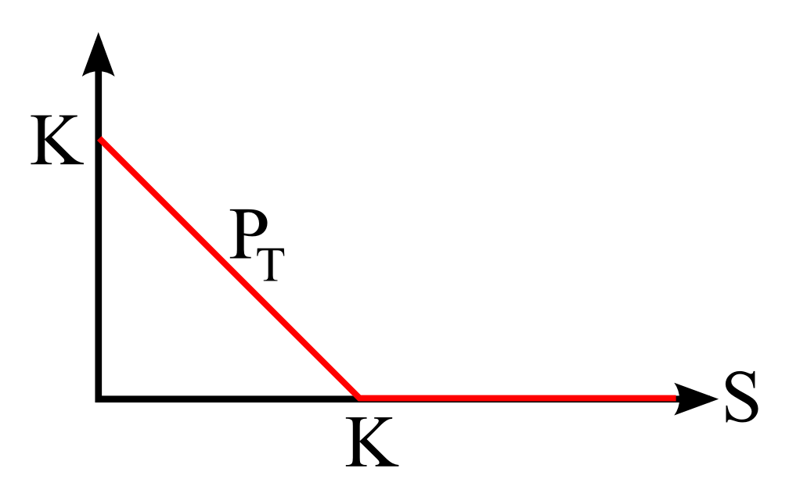

% Option prices: stylized facts
% Christian Groll
% March 19, 2015

# Option data

###

- a collection of option price graphics
- graphics are embedded as iframes to not intermix separate style
  sheets 

### Data sample

<table
class="data-frame"><tr><th></th><th>Date</th><th>ID</th><th>Price</th><th>Expiry</th><th>Strike</th><th>IsCall</th><th>EONIA_matched</th><th>Time_to_Maturity</th><th>DAX</th><th>Bid</th><th>Ask</th><th>Volume</th><th>Open_Interest</th></tr><tr><th>1</th><td>2006-07-03</td><td>c_20060721_4500</td><td>1212.0</td><td>2006-07-21</td><td>4500</td><td>true</td><td>0.0283102283088403</td><td>0.0549019607843137</td><td>5712.69</td><td>NA</td><td>NA</td><td>0</td><td>127</td></tr><tr><th>2</th><td>2006-07-04</td><td>c_20060721_4500</td><td>1232.6</td><td>2006-07-21</td><td>4500</td><td>true</td><td>0.0282186257343229</td><td>0.0509803921568627</td><td>5729.01</td><td>NA</td><td>NA</td><td>0</td><td>127</td></tr><tr><th>3</th><td>2006-07-05</td><td>c_20060721_4500</td><td>1131.1</td><td>2006-07-21</td><td>4500</td><td>true</td><td>0.0281095973321041</td><td>0.0470588235294118</td><td>5625.63</td><td>NA</td><td>NA</td><td>0</td><td>127</td></tr><tr><th>4</th><td>2006-07-06</td><td>c_20060721_4500</td><td>1197.0</td><td>2006-07-21</td><td>4500</td><td>true</td><td>0.0281618489048387</td><td>0.0431372549019608</td><td>5695.47</td><td>NA</td><td>NA</td><td>2</td><td>127</td></tr><tr><th>5</th><td>2006-07-07</td><td>c_20060721_4500</td><td>1185.1</td><td>2006-07-21</td><td>4500</td><td>true</td><td>0.0281130672686915</td><td>0.0392156862745098</td><td>5681.85</td><td>NA</td><td>NA</td><td>0</td><td>127</td></tr><tr><th>6</th><td>2006-07-10</td><td>c_20060721_4500</td><td>1210.3</td><td>2006-07-21</td><td>4500</td><td>true</td><td>0.0281756309615022</td><td>0.0352941176470588</td><td>5706.32</td><td>NA</td><td>NA</td><td>0</td><td>127</td></tr><tr><th>7</th><td>2006-07-11</td><td>c_20060721_4500</td><td>1125.9</td><td>2006-07-21</td><td>4500</td><td>true</td><td>0.0281527617515408</td><td>0.0313725490196078</td><td>5616.04</td><td>NA</td><td>NA</td><td>0</td><td>127</td></tr><tr><th>8</th><td>2006-07-12</td><td>c_20060721_4500</td><td>1134.8</td><td>2006-07-21</td><td>4500</td><td>true</td><td>0.0281460121797738</td><td>0.0274509803921569</td><td>5637.82</td><td>NA</td><td>NA</td><td>0</td><td>127</td></tr><tr><th>9</th><td>2006-07-13</td><td>c_20060721_4500</td><td>1032.0</td><td>2006-07-21</td><td>4500</td><td>true</td><td>0.0281552563922728</td><td>0.0235294117647059</td><td>5527.29</td><td>NA</td><td>NA</td><td>0</td><td>127</td></tr><tr><th>10</th><td>2006-07-14</td><td>c_20060721_4500</td><td>928.4</td><td>2006-07-21</td><td>4500</td><td>true</td><td>0.0281208757166548</td><td>0.0196078431372549</td><td>5422.22</td><td>NA</td><td>NA</td><td>0</td><td>127</td></tr><tr><th>11</th><td>2006-07-17</td><td>c_20060721_4500</td><td>916.1</td><td>2006-07-21</td><td>4500</td><td>true</td><td>0.0281208757166548</td><td>0.0156862745098039</td><td>5416.96</td><td>NA</td><td>NA</td><td>0</td><td>127</td></tr><tr><th>12</th><td>2006-07-18</td><td>c_20060721_4500</td><td>888.3</td><td>2006-07-21</td><td>4500</td><td>true</td><td>0.0281208757166548</td><td>0.0117647058823529</td><td>5396.85</td><td>NA</td><td>NA</td><td>0</td><td>127</td></tr><tr><th>13</th><td>2006-07-19</td><td>c_20060721_4500</td><td>1039.1</td><td>2006-07-21</td><td>4500</td><td>true</td><td>0.0281208757166548</td><td>0.00784313725490196</td><td>5539.29</td><td>NA</td><td>NA</td><td>0</td><td>127</td></tr><tr><th>14</th><td>2006-07-20</td><td>c_20060721_4500</td><td>1046.2</td><td>2006-07-21</td><td>4500</td><td>true</td><td>0.0281111529610312</td><td>0.00392156862745098</td><td>5545.82</td><td>NA</td><td>NA</td><td>102</td><td>127</td></tr><tr><th>15</th><td>2006-07-03</td><td>c_20060721_4600</td><td>1112.3</td><td>2006-07-21</td><td>4600</td><td>true</td><td>0.0283102283088403</td><td>0.0549019607843137</td><td>5712.69</td><td>NA</td><td>NA</td><td>0</td><td>235</td></tr><tr><th>16</th><td>2006-07-04</td><td>c_20060721_4600</td><td>1132.9</td><td>2006-07-21</td><td>4600</td><td>true</td><td>0.0282186257343229</td><td>0.0509803921568627</td><td>5729.01</td><td>NA</td><td>NA</td><td>0</td><td>235</td></tr><tr><th>17</th><td>2006-07-05</td><td>c_20060721_4600</td><td>1031.6</td><td>2006-07-21</td><td>4600</td><td>true</td><td>0.0281095973321041</td><td>0.0470588235294118</td><td>5625.63</td><td>NA</td><td>NA</td><td>0</td><td>235</td></tr><tr><th>18</th><td>2006-07-06</td><td>c_20060721_4600</td><td>1097.3</td><td>2006-07-21</td><td>4600</td><td>true</td><td>0.0281618489048387</td><td>0.0431372549019608</td><td>5695.47</td><td>NA</td><td>NA</td><td>0</td><td>235</td></tr><tr><th>19</th><td>2006-07-07</td><td>c_20060721_4600</td><td>1085.3</td><td>2006-07-21</td><td>4600</td><td>true</td><td>0.0281130672686915</td><td>0.0392156862745098</td><td>5681.85</td><td>NA</td><td>NA</td><td>0</td><td>235</td></tr><tr><th>20</th><td>2006-07-10</td><td>c_20060721_4600</td><td>1110.5</td><td>2006-07-21</td><td>4600</td><td>true</td><td>0.0281756309615022</td><td>0.0352941176470588</td><td>5706.32</td><td>NA</td><td>NA</td><td>0</td><td>235</td></tr><tr><th>21</th><td>2006-07-11</td><td>c_20060721_4600</td><td>1026.1</td><td>2006-07-21</td><td>4600</td><td>true</td><td>0.0281527617515408</td><td>0.0313725490196078</td><td>5616.04</td><td>NA</td><td>NA</td><td>0</td><td>235</td></tr><tr><th>22</th><td>2006-07-12</td><td>c_20060721_4600</td><td>1034.9</td><td>2006-07-21</td><td>4600</td><td>true</td><td>0.0281460121797738</td><td>0.0274509803921569</td><td>5637.82</td><td>NA</td><td>NA</td><td>0</td><td>235</td></tr><tr><th>23</th><td>2006-07-13</td><td>c_20060721_4600</td><td>932.1</td><td>2006-07-21</td><td>4600</td><td>true</td><td>0.0281552563922728</td><td>0.0235294117647059</td><td>5527.29</td><td>NA</td><td>NA</td><td>0</td><td>235</td></tr><tr><th>24</th><td>2006-07-14</td><td>c_20060721_4600</td><td>828.5</td><td>2006-07-21</td><td>4600</td><td>true</td><td>0.0281208757166548</td><td>0.0196078431372549</td><td>5422.22</td><td>NA</td><td>NA</td><td>0</td><td>232</td></tr><tr><th>25</th><td>2006-07-17</td><td>c_20060721_4600</td><td>816.2</td><td>2006-07-21</td><td>4600</td><td>true</td><td>0.0281208757166548</td><td>0.0156862745098039</td><td>5416.96</td><td>NA</td><td>NA</td><td>0</td><td>232</td></tr><tr><th>26</th><td>2006-07-18</td><td>c_20060721_4600</td><td>788.3</td><td>2006-07-21</td><td>4600</td><td>true</td><td>0.0281208757166548</td><td>0.0117647058823529</td><td>5396.85</td><td>NA</td><td>NA</td><td>0</td><td>232</td></tr><tr><th>27</th><td>2006-07-19</td><td>c_20060721_4600</td><td>939.3</td><td>2006-07-21</td><td>4600</td><td>true</td><td>0.0281208757166548</td><td>0.00784313725490196</td><td>5539.29</td><td>NA</td><td>NA</td><td>14</td><td>232</td></tr><tr><th>28</th><td>2006-07-20</td><td>c_20060721_4600</td><td>946.2</td><td>2006-07-21</td><td>4600</td><td>true</td><td>0.0281111529610312</td><td>0.00392156862745098</td><td>5545.82</td><td>NA</td><td>NA</td><td>0</td><td>232</td></tr><tr><th>29</th><td>2006-07-03</td><td>c_20060721_4700</td><td>1012.7</td><td>2006-07-21</td><td>4700</td><td>true</td><td>0.0283102283088403</td><td>0.0549019607843137</td><td>5712.69</td><td>NA</td><td>NA</td><td>0</td><td>212</td></tr><tr><th>30</th><td>2006-07-04</td><td>c_20060721_4700</td><td>1033.2</td><td>2006-07-21</td><td>4700</td><td>true</td><td>0.0282186257343229</td><td>0.0509803921568627</td><td>5729.01</td><td>NA</td><td>NA</td><td>0</td><td>212</td></tr><tr><th>&vellip;</th><td>&vellip;</td><td>&vellip;</td><td>&vellip;</td><td>&vellip;</td><td>&vellip;</td><td>&vellip;</td><td>&vellip;</td><td>&vellip;</td><td>&vellip;</td><td>&vellip;</td><td>&vellip;</td><td>&vellip;</td><td>&vellip;</td></tr></table>

  
### 

- option price data from **2006-07-03** until **2013-12-30**

. . .

- range of **expiry dates**: 2006-07-21 until 2014-12-19

. . .

- **2,025,129** observations:
	- call options: 987,878 observations
	- put options: 1,037,251 observations

. . .

- data on **12,917** options:
	- 6,321 call options
	- 6,596 put options

### Missing values

- absolute number

<table class="data-frame"><tbody><tr><th>Bid</th><th>Ask</th><th>Volume</th></tr><tr><td>1597934</td><td>1574162</td><td>11</td></tr></tbody></table>

- relative frequency

<table class="data-frame"><tbody><tr><th>Bid</th><th>Ask</th><th>Volume</th></tr><tr><td>0.789</td><td>0.777</td><td>0.000005</td></tr></tbody></table>

###

- missing volumes: no pattern?

<table class="data-frame"><tbody><tr><th></th><th>Date</th><th>IsCall</th><th>Strike</th><th>DAX</th><th>Time_to_Maturity</th></tr><tr><th>1</th><td>2008-05-22</td><td>true</td><td>7000</td><td>7070.33</td><td>0.337254901960784</td></tr><tr><th>2</th><td>2008-05-23</td><td>true</td><td>7000</td><td>6944.05</td><td>0.333333333333333</td></tr><tr><th>3</th><td>2007-11-27</td><td>true</td><td>7800</td><td>7531.35</td><td>0.803921568627451</td></tr><tr><th>4</th><td>2008-05-22</td><td>true</td><td>7800</td><td>7070.33</td><td>0.337254901960784</td></tr><tr><th>5</th><td>2008-05-23</td><td>true</td><td>7800</td><td>6944.05</td><td>0.333333333333333</td></tr><tr><th>6</th><td>2007-11-27</td><td>true</td><td>8800</td><td>7531.35</td><td>0.803921568627451</td></tr><tr><th>7</th><td>2008-05-22</td><td>true</td><td>8800</td><td>7070.33</td><td>0.337254901960784</td></tr><tr><th>8</th><td>2008-05-23</td><td>true</td><td>8800</td><td>6944.05</td><td>0.333333333333333</td></tr><tr><th>9</th><td>2007-11-27</td><td>false</td><td>8800</td><td>7531.35</td><td>0.803921568627451</td></tr><tr><th>10</th><td>2008-05-22</td><td>false</td><td>8800</td><td>7070.33</td><td>0.337254901960784</td></tr><tr><th>11</th><td>2008-05-23</td><td>false</td><td>8800</td><td>6944.05</td><td>0.333333333333333</td></tr></tbody></table>

### Volume data

- **zero volume** in 70.7 percent of cases

. . .

<object type="image/svg+xml" style="background: white" data="../../pics/volume_hist.svg">Your browser does not
support SVG</object>

###

- on log-scale: no exponential decay?

<object type="image/svg+xml" style="background: white" data="../../pics/volume_log_hist.svg">Your browser does not
support SVG</object>

### 

- largest volumes

<table class="data-frame"><tbody><tr><th></th><th>Volume</th></tr><tr><th>1</th><td>149504</td></tr><tr><th>2</th><td>126367</td></tr><tr><th>3</th><td>103815</td></tr><tr><th>4</th><td>88041</td></tr><tr><th>5</th><td>86313</td></tr><tr><th>6</th><td>78254</td></tr><tr><th>7</th><td>77251</td></tr><tr><th>8</th><td>73883</td></tr><tr><th>9</th><td>73029</td></tr><tr><th>10</th><td>72047</td></tr><tr><th>11</th><td>71615</td></tr><tr><th>12</th><td>70036</td></tr></tbody></table>

### Open interest

<object type="image/svg+xml" style="background: white" data="../../pics/open_interest_hist.svg">Your browser does not
support SVG</object>

###

- on log-scale: no exponential decay?

<object type="image/svg+xml" style="background: white" data="../../pics/open_interest_log_hist.svg">Your browser does not
support SVG</object>

###

<object type="image/svg+xml" style="background: white" data="../../pics/open_interest_over_time.svg">Your browser does not
support SVG</object>

### Listed options

<object type="image/svg+xml" style="background: white" data="../../pics/number_of_listed_options.svg">Your browser does not
support SVG</object>

###

- listed maturities

<object type="image/svg+xml" style="background: white" data="../../pics/number_of_listed_maturities.svg">Your browser does not
support SVG</object>

###

- first listing

<object type="image/svg+xml" style="background: white" data="../../pics/maturity_at_first_list.svg">Your browser does not
support SVG</object>

###

<object type="image/svg+xml" style="background: white" data="../../pics/maturity_at_first_list_zoomed.svg">Your browser does not
support SVG</object>

# Option prices

### Call payoff

### Put payoff

## No arbitrage bounds 

following [@rv_hull_2009_options_futures_other_derivatives]

## Upper bound call option

###

- the payoff of a call option is always smaller than the value of the
  underlying 

. . .

###

$\Rightarrow$ present value of a call option must be smaller than
present price of the underlying

. . .

\begin{equation*}
c\leq S_{0}
\end{equation*}

## Upper bound put option

###

- payoff always smaller than $K$ at maturity

. . .

###

$\Rightarrow$ worth less than the present value of $K$ today

. . .

\begin{equation*}
p \leq Ke^{-rT}
\end{equation*}

## Lower bound call option

###

Portfolio: 

- zero-coupon bond providing payoff $K$ at $T$
- European call option, strike $K$, expiry $T$

###

###

Joint portfolio payoff...

###

... is always larger than payoff of single stock:

###

\begin{align*}
Ke^{-rT} + c &\geq S_{0} & \Leftrightarrow\\
c&\geq S_{0} - Ke^{-rT}&
\end{align*}

. . .

**lower bound**:

\begin{equation*}
c = \max\{S_{0} - Ke^{-rT}, 0\}
\end{equation*}

## Upper bound call option

###

Portfolio: 

- single share of underlying
- European put option, strike $K$, expiry $T$

###

Joint portfolio payoff ...

###

... is always larger than payoff of zero-coupon bond providing payoff
$K$ at $T$

###

\begin{align*}
p + S_{0}&\geq Ke^{-rT} & \Leftrightarrow \\
p &\geq Ke^{-rT} - S_{0}
\end{align*}

. . .

**lower bound**:

\begin{equation*}
p = \max\{Ke^{-rT} - S_{0}, 0\}
\end{equation*}

### No arbitrage bounds

\begin{align*}
\max\{Ke^{-rT} - S_{0}, 0\} \leq &p \leq Ke^{-rT}\\
\max\{S_{0} - Ke^{-rT}, 0\} \leq &c \leq S_{0}
\end{align*}

## Put-Call parity

# Black-Scholes option theory

## Black-Scholes formula

### 

\begin{equation*}
B(S,K,T,r,\sigma) = dkdkd
\end{equation*}

## Greeks

### Non-stationarity of option prices

option price must be modelled as function of underlying:

\begin{equation*}
c = f(\bf{X})
\end{equation*}

###

- most visible lines are (far) in the money and hence have an option
  delta of approximately 1

<iframe id="ifrm" src="../../charts/singleCohort.html" 
onload="setIframeSize(this.id)"
allowtransparency="true"
style="background: white;height:500px;width:1000px"></iframe>
